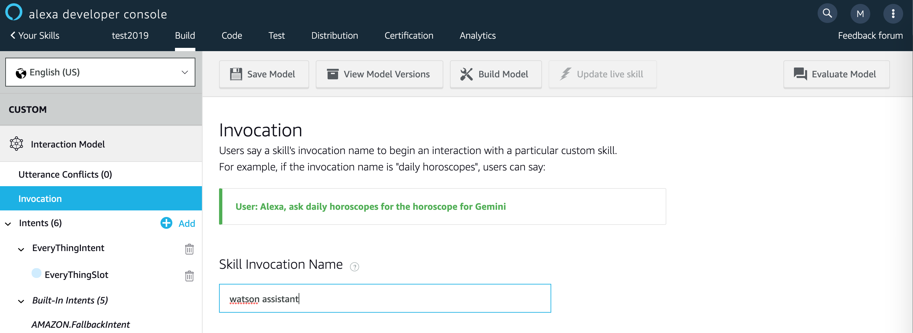
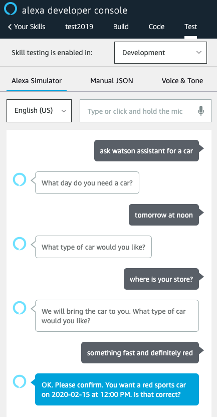

[](https://travis-ci.org/IBM/alexa-skill-watson-conversation)

# Create an Alexa skill using Watson Assistant and OpenWhisk

> Watson Conversation is now Watson Assistant. Although some images in this code pattern may show the service as Watson Conversation, the steps and processes will still work.

In this Code Pattern, we will create an Alexa skill using
[Watson Assistant](https://www.ibm.com/watson/developercloud/conversation.html)
via the [Apache OpenWhisk](http://openwhisk.incubator.apache.org/) serverless framework.
Alexa is the voice service behind products like the Amazon Echo.
IBM Cloud Functions (based on Apache OpenWhisk) will be used to integrate Alexa
with Watson Assistant.
Credit goes to [Niklas Heidloff](http://heidloff.net/) for creating the original project.

An example conversation is included to demonstrate how to pass context between
different intents. You can also use this Code Pattern to try out a conversation from
the [Bot Asset Exchange (BAE)](https://developer.ibm.com/code/exchanges/bots/).

When the reader has completed this Code Pattern, they will understand how to:

* Create an OpenWhisk action in the IBM Cloud Functions serverless platform
* Use Redis to store a session's conversation context across events
* Import a conversation from the Bot Asset Exchange (BAE) or a JSON file
* Invoke a conversation with Watson using Node.js
* Use the Weather Channel Data service to lookup locations and forecasts
* Create an Alexa skill to reach tens of millions of customers


## Flow
1. User says "Alexa, ask Watson...".
2. Alexa invokes IBM Cloud Functions with input text.
3. The action gets the conversation context from Redis (if any).
4. The action gets a response from Watson Assistant.
5. The Weather Company Data service provides the forecast (when applicable).
6. The response context is stored in Redis.
7. The response text is sent back to Alexa.
8. Alexa replies to the user.

## Included components

* [Watson Assistant](https://www.ibm.com/watson/developercloud/conversation.html): Create a chatbot with a program that conducts a conversation via auditory or textual methods.
* [OpenWhisk](https://console.ng.bluemix.net/openwhisk): Execute code on demand in a highly scalable, serverless environment.
* [Redis](https://redis.io/): An open-source, in-memory data structure store, used as a database, cache and message broker.

## Featured technologies
* [Serverless](https://www.ibm.com/cloud-computing/bluemix/openwhisk): An event-action platform that allows you to execute code in response to an event.
* [Databases](https://en.wikipedia.org/wiki/IBM_Information_Management_System#.22Full_Function.22_databases): Repository for storing and managing collections of data.
* [Node.js](https://nodejs.org/): An open-source JavaScript run-time environment for executing server-side JavaScript code.

# Watch the Video

[](https://www.youtube.com/watch?v=_iODArA1Eqs)

# Steps

## Run locally

1. [Clone the repo](#1-clone-the-repo)
1. [Create a Watson Assistant workspace](#2-create-a-watson-conversation-workspace)
1. [Create a Compose for Redis service](#3-create-a-compose-for-redis-service)
1. [Create a Weather Company Data service](#4-create-a-weather-company-data-service)
1. [Configure credentials](#5-configure-credentials)
1. [Create the OpenWhisk action](#6-create-the-openwhisk-action)
1. [Create an Alexa skill](#7-create-an-alexa-skill)
1. [Talk to it](#8-talk-to-it)

### 1. Clone the repo

Clone the `alexa-skill-watson-conversation` repo locally and `cd` to the local repo
(for commands in later steps). In a terminal, run:

```
$ git clone https://github.com/IBM/alexa-skill-watson-conversation
$ cd alexa-skill-watson-conversation
```

### 2. Create a Watson Assistant workspace

Sign up for [IBM Cloud](https://console.ng.bluemix.net/registration/) if you don't have an IBM Cloud account yet.

Use one or both of these options (with or without BAE) to setup a Assistant workspace.

#### Using Bot Asset Exchange (BAE)
If you are using
[BAE](https://developer.ibm.com/code/exchanges/bots),
click on a `Deploy this bot` button to automatically create
your Assistant service and import your workspace. The service will be named
`Bot Asset Exchange Workspaces` and can hold up to 5 selected workspaces.

#### Using the provided workspace.json file
Create the service by following this link and hitting `Create`:
* [**Watson Assistant**](https://console.ng.bluemix.net/catalog/services/conversation)

Import the Assistant workspace.json:
* Find the Assistant service in your IBM Cloud Dashboard.
* Click on the service and then click on `Launch Tool`.
* Go to the `Workspaces` tab.
* Click on the **import** icon (next to the Workspaces Create button).
* Click `Choose a file`, go to your cloned repo dir, and `Open` the workspace.json file in [`data/conversation/workspaces/workspace.json`](data/conversation/workspaces/workspace.json).
* Select `Everything` and click `Import`.

### 3. Create a Compose for Redis service

> NOTE: The code currently requires you to disable TLS.

  1. Follow this link: [**Compose for Redis**](https://console.ng.bluemix.net/catalog/services/compose-for-redis)
  1. Use the `TLS Enabled` pull-down to select `False`
  1. Hit the `Create` button


### 4. Create a Weather Company Data service

If you are using the provided workspace.json, use Weather Company Data to provide weather responses.

Follow this link and hit `Create`:
* [**Weather Company Data**](https://console.ng.bluemix.net/catalog/services/weather-company-data)

### 5. Configure credentials

The default runtime parameters need to be set for the action.
These can be set on the command-line or via the IBM Cloud UI.
Here we've provided a params.sample file for you to copy and use
with the `-param-file .params` option (which is used in the instructions below).

Copy the [`params.sample`](params.sample) to `.params`.

```
$ cp params.sample .params
```
Edit the `.params` file and add the required settings.

#### `params.sample:`

* If the service credentials from IBM Watson Assistant is username/password based as below populate the username, password and workspace_id and replace `.params` file with the json


```json
{
  "CONVERSATION_USERNAME": "<add_assistant_username>",
  "CONVERSATION_PASSWORD": "<add_assistant_password>",
  "WORKSPACE_ID": "<add_assistant_workspace_id>",
  "REDIS_URI": "<add_redis_uri>",
  "WEATHER_URL": "<add_weather_url>"
}
```

* If the service credentials from IBM Watson Assistant is IAM based as below, populate the IAM apikey, url, and workspace_id and replace the `.params` file


```json 
{
  "CONVERSATION_IAM_APIKEY": "<add_assistant_apikey>",
  "CONVERSATION_IAM_URL": "<add_assistant_url>",
  "WORKSPACE_ID": "<add_assistant_workspace_id>",
  "REDIS_URI": "<add_redis_uri>",
  "WEATHER_URL": "<add_weather_url>"
}
```

#### How to find the credentials and workspace ID:

The credentials for IBM Cloud services (Assistant,
Compose for Redis, and Weather Company Data), can be found in the IBM Cloud UI.
* Go to your IBM Cloud Dashboard.
* Find each service in the `Cloud Foundry Services` list.
* Click on the service name.
* Click on `Service credentials` in the sidebar.
* If there are no credentials listed, click the `New credential` button (some services will create one by default).
* Click on `View credentials` to see your credentials.
* Collect the username, password, uri, and url as needed to fill out the .params file.

To find the `WORKSPACE_ID` for Watson Assistant:
* Go to your IBM Cloud Dashboard.
* Click on your Assistant service in the `Cloud Foundry Services` list.
* Click on `Manage` in the sidebar.
* Click on the `Launch tool` button.
* Click on the `Workspaces` tab.
* Find the card for the workspace you would like to use. Look for `Alexa Sample`, if you uploaded workspace.json. The name will vary if you used BAE.
* Click on the three dots in the upper right-hand corner of the card and select `View details`.
* Copy the `Workspace ID` GUID.

### 6. Create the OpenWhisk action

Run the following to [install the OpenWhisk bindings for IBM Cloud](https://console.bluemix.net/openwhisk/learn/cli):
```
bx plugin install Cloud-Functions -r Bluemix
```

Use `bx login` to initially login or to change your target:
```
bx login -a <API endpoint> -o <Organization> -s <Space>
```

Run the following command to update your OpenWhisk bindings if they are already installed:
```
bx wsk package refresh
```

Run the following to test OpenWhisk on IBM Cloud:
```
bx wsk action invoke /whisk.system/utils/echo -p message hello --result
```

#### Create the OpenWhisk action
Run these commands to gather Node.js requirements, zip the source files, and upload the zipped files
to create a raw HTTP web action in OpenWhisk.

> Note: You can use the same commands to update the action if you modify the code or the .params.

```sh
npm install
rm action.zip
zip -r action.zip main.js package* node_modules
bx wsk action update alexa-watson action.zip --kind nodejs:6 --web raw --param-file .params
```

#### Determine your IBM Cloud endpoint:

To find this URL, navigate to [IBM Cloud Functions - Actions](https://console.bluemix.net/openwhisk/manage/actions), click on your
`alexa-watson` action and use the sidebar to navigate to `Endpoints`.  The Web Action URL ends with `.json`.


### 7. Create an Alexa skill
Sign up for an Amazon Developer Portal account [here](http://developer.amazon.com/).

Go to https://developer.amazon.com/alexa/console/ask and click the `Create Skill` button.


Provide a name and hit `Next`.

Use the `Select` button to create a **Custom** skill and hit the `Create Skill` button.


Provide an invocation name:



Add a custom slot type:

* In the left sidebar menu, click on `Slot Types (#)` and hit `+ Add`.


* Use the name `BAG_OF_WORDS` and hit the `Create custom slot type` button.


* Now `BAG_OF_WORDS` needs a slot value. Just enter `Hello World` and hit the plus sign so that it has a slot value.


Add a custom intent type:

* In the left sidebar menu, click on `Intents (#)` and hit `+ Add`.


* Use the name `EveryThingIntent` and hit the `Create custom intent` button.
* Add `{EveryThingSlot}` under Sample Utterances. Use the plus sign to create the `EveryThingSlot`.


* Scroll down to `Intent Slots (#)`
* Use the `Select a slot type` pulldown to give `EveryThingSlot` the slot type `BAG_OF_WORDS`.


Click on `Save Model` and then `Build Model`.


Configure the endpoint:

* Click on `Endpoint` in the right-hand sidebar.
* Select `HTTPS` as the Service Endpoint Type.
* For the Default Region enter the **HTTPS** service endpoint which is the URL of your OpenWhisk **Web Action** from step 6.
* Use the pull-down to select `My development endpoint is a sub-domain of a domain that has a wildcard certificate from a certificate authority`.
* Click the `Save Endpoints` button!


### 8. Talk to it

Use the `Test` tab in the Amazon developer console.

Use the slider to enable your skill for testing. You can type or talk and test the skill in the test UI.

> Once enabled, you can run the sample via Alexa enabled devices, or the [Echo simulator](https://echosim.io/).

You can invite others to test it with the beta test feature. In order to be
eligible for beta test, you must fill out most of the publishing information.

You probably shouldn't publish this example, but you are now
ready to create and publish your own Alexa skill.

# Sample output

Here is a sample conversation flow using the provided conversation workspace.json:



The sample has been implemented via the [slots filling](http://heidloff.net/article/conversation-watson-slots) functionality in Watson Assistant. The screenshot shows how the entity (slot) 'location' is defined as mandatory and how the value is stored in a context variable.


The next screenshot shows how the location is automatically used in the next 'weather' intent.


# Troubleshooting

  > Use the IBM Cloud UI to monitor logs, or use this command to show the latest activation log:
  ```
  bx wsk activation list -l1 | tail -n1 | cut -d ' ' -f1 | xargs bx wsk activation logs
  ```

* Invoke from command line

  > Use these commands to invoke the action (named alexa-watson in the example) without any input, then check the latest logs. Expect an error ("Must be called from Alexa").
  ```
  bx wsk action invoke alexa-watson -bvd
  bx wsk activation list -l1 | tail -n1 | cut -d ' ' -f1 | xargs bx wsk activation logs
  ```

# Links

* [Demo on Youtube](https://www.youtube.com/watch?v=_iODArA1Eqs): Watch the video.
* [Watson Node.js SDK](https://github.com/watson-developer-cloud/node-sdk): Download the Watson Node SDK.
* [Alexa/Google Home infinite loop conversation](https://www.youtube.com/watch?v=LEz9AU9c2qQ): Check out how it works.
* [Award winners](https://www.voicebot.ai/2017/03/01/amazon-alexa-ibm-watson-won-2016-voice-assistant-wars-already-winning-2017/): Amazon Alexa and IBM Watson won the 2016 Voice Assistant Wars.
* [Bluemix Stirred](https://bluemixstirred.wordpress.com/2017/05/11/use-the-amazon-echo-dot-with-the-watson-conversation-service/): Learn how to use the Amazon Echo and Dot with the Watson Assistant Service.
* [Old Demo on Youtube](https://www.youtube.com/watch?v=4cTSkX0wSV8): Watch the video.

# Learn more

* **Artificial Intelligence Code Patterns**: Enjoyed this Code Pattern? Check out our other [AI Code Patterns](https://developer.ibm.com/code/technologies/artificial-intelligence/).
* **AI and Data Code Pattern Playlist**: Bookmark our [playlist](https://www.youtube.com/playlist?list=PLzUbsvIyrNfknNewObx5N7uGZ5FKH0Fde) with all of our Code Pattern videos
* **With Watson**: Want to take your Watson app to the next level? Looking to utilize Watson Brand assets? [Join the With Watson program](https://www.ibm.com/watson/with-watson/) to leverage exclusive brand, marketing, and tech resources to amplify and accelerate your Watson embedded commercial solution.

# License
[Apache 2.0](LICENSE)
